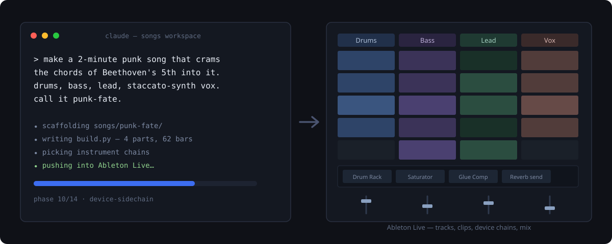
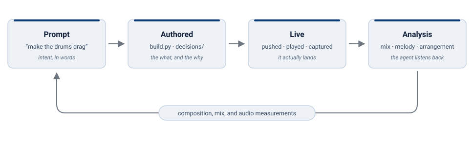

# Hallucinote

**Make music in Ableton Live by describing it to Claude — composition, sound design, and mix, authored as code you can version and fork.**

[](https://github.com/brookstalley/hallucinote/actions/workflows/ci.yml)
[](LICENSE)




You describe a song in plain language. Claude writes it — the composition, the sound design, the mix — as code: a Python `build.py` plus a captured mix snapshot, built into a working database and pushed into a running Ableton Live set.

Tweak a fader in Live and pull the change back through the same path. The song is a directory you commit to git — reproducible and forkable, not a binary `.als` you hope to find again.

---

## See it

> *"Make a 2-minute punk song that crams the chord progression of Beethoven's 5th into those two minutes. Drums, bass, lead guitar, and vocals on a staccato synth. Call it punk-fate."*

Claude scaffolds `songs/punk-fate/`, picks an instrument chain per track, writes the note-generating code, and pushes the whole thing into Live through fourteen ordered phases:

```
tempo → meter → tracks → returns → scenes → clips →
mix → devices → routing → device-sidechain → envelopes →
performed automation → arrangement → cues
```

When it finishes, you press play and hear a finished song.

Don't like the bridge? *"Lift the lead an octave there, and make the chorus drums drag."* Claude edits the code and re-pushes. Re-runs are idempotent — it changes what you asked for and leaves the rest alone.

## How it works



- **You talk; Claude authors code.** Notes, arrangement, and automation are Python in `build.py`. Instruments, device chains, and the dialed mix live in a declarative snapshot. Both are git-tracked source.
- **Push materializes; pull ingests.** Push drives the song into a fresh or existing Live set. Pull diffs Live against the song and folds your manual edits back in.
- **The agent listens.** Claude can render the set to audio and review the mix against your stated intent — masking, loudness, groove — and tell you the one thing holding the chorus back, as a producer's question, not a score.

## What you can do

- **Compose from a prompt — any genre, any shape.** Conceptual (*"a song about overcoming loss"*), musical (*"a Baroque prelude in G minor from a single broken-chord figuration"*), or purely stylistic (*"Duran Duran if they dropped acid with Black Sabbath"*).
- **Under-specify on purpose.** Claude works out what your prompt actually leans on (`/hallucinote:song-brief`) — key, tempo, what a named turn means musically — and comes back **once** with informed proposals you can wave through or redirect in a word.
- **Iterate by talking.** *"Raise the verse ghost snares."* *"Route the drums through a sub-bus and glue-compress it."* Claude edits the code and re-pushes.
- **Get sound design included.** Device chains, dialed parameters, and sends ship with the song — a finished song arrives with the sound it's supposed to have, not a mix-pass to-do list.
- **Pull manual edits back.** Move faders, mutes, or notes in Live, then ask Claude to pull them into the song.
- **Get an honest review.** Ask *"is the chorus landing?"* and Claude reads the composition — or the rendered audio — against what you said you wanted.
- **Share and fork.** A song is a directory in a git repo. A collaborator clones it, and Hallucinote checks their plugins before pushing — telling them exactly what to install if something's missing.

## Status

Actively developed, shipping releases, and honest about the rough edges:

- **Platforms:** Ableton Live 12 on macOS and Windows (no Linux — Ableton ships no Linux build).
- **Editions:** the full authoring loop runs on **any Live 12 edition, Standard included**. One feature — the measured mix review — needs **Max for Live** (Suite, or the M4L add-on); Standard users review by ear with the symbolic review instead.
- **Boundaries:** Claude authors MIDI and the mix; a recorded vocal take can't yet be read back through the bridge.

Everything else we've consciously accepted — each with its workaround — is in [**Known issues**](docs/known-issues.md).

## Install

The plugin is **self-contained**: installing it brings the skills, the Ableton bridge, and the composing engine, all in one managed environment. No separate engine to clone, nothing on PyPI to track.

**1. Prerequisites** — [Claude Code](https://claude.ai/code), Ableton Live 12, Python 3.10+, and [uv](https://docs.astral.sh/uv/) (`brew install uv` on macOS, `winget install astral-sh.uv` on Windows).

**2. Install the plugin** — in Claude Code:

```text
/plugin marketplace add brookstalley/hallucinote
/plugin install hallucinote@hallucinote
```

**3. Connect Ableton** — quit Live, then run **`/hallucinote:ableton-mcp-install`** (it installs the Remote Script and analyzer — the one thing the plugin can't do for you). Reopen Live, and in **Preferences → Link, Tempo & MIDI** assign **Hallucinote** to a free Control Surface slot. Restart Claude Code so the bridge connects.

**4. Verify** — ask Claude: *"please get the current set's info from Ableton."* Tempo, signature, and track counts back means the bridge is working.

**Hacking on the framework itself?** Load it from your checkout with `claude --plugin-dir /path/to/hallucinote` — see [`CONTRIBUTING.md`](CONTRIBUTING.md).

## Your first song

Day to day, it's three things:

1. **Open Live** with an empty set.
2. **Start Claude Code in your songs workspace** — a git repo where your songs live. Don't have one? In an empty folder, ask Claude to *"set up a songs workspace here"* — it creates the marker file, the `.gitignore`, and the git repo.
3. **Describe a song.** Or run **`/hallucinote:getting-started`** first — it checks your setup and points you at the next step.

The [**Quickstart**](docs/quickstart.md) walks the first song end to end in about ten minutes.

## Troubleshooting

- **"Version mismatch" / "handshake missing"** — the bridge and Live's Remote Script have diverged (usually after an update). Rerun `/hallucinote:ableton-mcp-install`, then **fully quit and reopen Live** — Live caches Control Surface modules at startup.
- **Session info hangs or says "no connection"** — Live isn't running, the Control Surface slot isn't assigned, or Claude Code wasn't restarted after assigning it.
- **Anything else** — ask Claude to **run preflight**; it prints a report of exactly what the installer can and can't find. More in the [FAQ](docs/faq.md).

Bugs go to [issues](https://github.com/brookstalley/hallucinote/issues); report vulnerabilities privately instead — see [`SECURITY.md`](SECURITY.md).

## Learn more

| If you want to… | Read |
|---|---|
| Build your first song, step by step | [`docs/quickstart.md`](docs/quickstart.md) |
| See everything you can ask for | [`docs/skills.md`](docs/skills.md) |
| Understand the whole song-making lifecycle | [`docs/song-workflow.md`](docs/song-workflow.md) |
| Share a song with a collaborator | [`docs/collaboration.md`](docs/collaboration.md) |
| Look something up / fix a problem | [`docs/faq.md`](docs/faq.md) |
| Know what's not supported yet | [`docs/known-issues.md`](docs/known-issues.md) |
| Understand the design philosophy | [`docs/VISION.md`](docs/VISION.md) |
| Read or edit a song's `build.py` | [`docs/song-authoring-conventions.md`](docs/song-authoring-conventions.md) |
| See what changed in a release | [`CHANGELOG.md`](CHANGELOG.md) |
| Contribute code | [`CONTRIBUTING.md`](CONTRIBUTING.md) |
| Browse all the docs | [`docs/README.md`](docs/README.md) |

## Project layout

```
src/hallucinote/      # composition engine: db, generators, sync, capture
hallucinote_mcp/      # the MCP bridge server (13 unified Ableton tools)
skills/               # the /hallucinote:* Claude Code skills the plugin ships
docs/                 # quickstart, song workflow, conventions, FAQ, schemas, …
```

This is the **framework** repo. Your **songs live in a separate workspace repo**, each song a self-contained directory: the build code, the mix snapshot, its decision history, and its tests.

## License

MIT. See [`LICENSE`](LICENSE).
