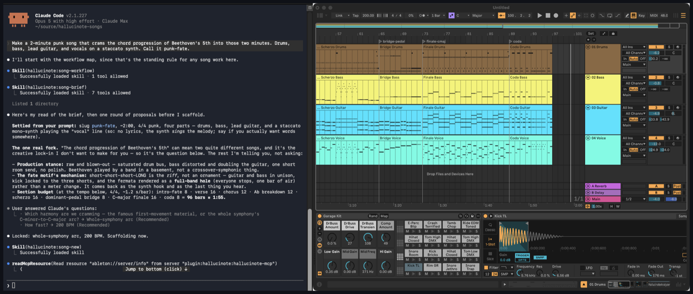

# Hallucinote

**Describe what you're after, hear it, argue with it — music as code you can read, fork and rewrite.**

[](https://github.com/brookstalley/hallucinote/actions/workflows/ci.yml) [](LICENSE)




Say what you're going for, and it gets built into a running Live set — `build.py` for the notes, a snapshot for the instruments and mix.
Then listen, change your mind, explore new ideas.
Because the song is code in a git directory, trying the half-time bridge or a key change costs a branch and a minute: keep it, or throw it away and try the next one.

Round-trip to Ableton: record MIDI in Ableton and pull it back to work on in Hallucinote. Audio clips are built to make the trip too — drop a sample into a slot and pull stages it into the song's build state for you to fold into `build.py` — at the maturity `docs/capability-truth.md` states (built, not yet verified against a real set); what Live *recorded* (a take) still can't be read back.

---

## See it

Accelerated video: from prompt to finished arrangement.

<video src="https://github.com/user-attachments/assets/6032b568-a103-439b-8397-a6ca7cdec0eb" controls muted></video>

*The chat is staged so the build runs under the conversation and there is something to watch; real sessions are more iterative and take longer.*

A different song, made the same way, ships in this repo as source:

> *"Make a 2-minute punk song that crams the chord progression of Beethoven's 5th into those two minutes. Drums, bass, rhythm guitar, and vocals emulated by a lead guitar. Call it punk-fate."*

This prompt is cheating a bit, because it implicitly specifies arrangement and harmony.
But it allowed a ~45 minute build, iterating on micro timing (punk's not dead!), instrumentation, and mixing and production.
It took a couple of sessions to get right, always with the user in charge.
The result:

[](docs/assets/tour-chapter2.mp3)

**[▶ Listen — punk-fate, 1:58](docs/assets/tour-chapter2.mp3)** · The finished song ships here as source: [`examples/punk-fate/`](examples/punk-fate/).

Getting there runs fourteen ordered phases:

```
tempo → meter → tracks → returns → scenes → clips →
mix → devices → routing → device-sidechain → envelopes →
performed automation → arrangement → cues
```

Want the bridge to hit harder?
*"Lift the lead an octave in the bridge, and make the chorus drums drag."* Claude edits the code and re-pushes, changing what you asked for and leaving the rest alone.

**Beat by beat, with the transcript, the screenshots and the mix numbers: [the tour](docs/tour.md).**

## How it works


- **You decide; it writes the decision down.** Notes, arrangement and automation in `build.py`; instruments, chains and the dialed mix in a snapshot.
  Every choice is legible afterwards — you can read what was done, and why, and change it.
- **The notes come from generators you can read.** Parametric Python — `tresillo`, `walking_bass`, kit abstractions, per-part feel.
  Claude's craft is choosing which to call and with what musical parameters, then writing that down.
  What lands in Live is MIDI and mixer state in a session you own outright.
- **Push materializes; pull ingests.** Push drives the song into a fresh or existing set; pull folds your manual Live edits back in.
  Re-runs are idempotent.
- **It listens back, and tells you straight.** Ask *"is the chorus landing?"* and Claude reads the composition, or renders the set and measures masking, loudness and groove, against the intent *you* declared — then reports what it found and what it would change.
  Real numbers, and an opinion you can overrule.

## Who it's for

- **Curious how songs get put together.** Ask for something, then ask why it works that way.
  It proposes with the reasoning showing — *"E minor, so the chorus can lift into the relative major"* — and you can overrule it and hear the difference straight away.
  You learn the craft by watching choices get made, then making better ones.
- **Playing already, and reaching further.** The arrangement you can hear in your head but would spend a week programming: a bassline weaving between two different kick patterns, thirty-two bars of hats that breathe, a polyrhythmic bridge.
  Ask for it and listen to it.
- **Deep in it.** Leverage.
  Bulk edits you'd otherwise script by hand, chorus variants on branches you A/B and discard, and a review pass that measures masking, loudness and timing against the intent you declared — then tells you where it disagrees.
  A second opinion with numbers behind it is rarer than it should be.

## What to ask for

- **Any genre, any shape.** Conceptual (*"a song about overcoming loss"*), musical (*"a Baroque prelude in G minor from a single broken-chord figuration"*), or stylistic (*"Duran Duran if they dropped acid with Black Sabbath"*).
- **Under-specify on purpose.** Claude works out what your prompt leans on (`/hallucinote:song-brief`) — key, tempo, what a named turn means musically — and brings you proposals you can wave through or redirect in a word. It keeps talking until you hand off, and once there is something worth hearing it offers to play it rather than building on past you.
- **Share and fork.** A collaborator clones the directory; Hallucinote checks their plugins first and names anything missing.

## Status

Actively developed, and honest about the rough edges:

- **Platforms:** Ableton Live 12 on macOS and Windows (Ableton ships no Linux build). macOS is where it's developed day to day; the Windows paths are implemented and unit-tested, with fewer real sessions behind them.
- **Editions:** the full authoring loop is exercised on **Live 12 Standard and Suite**.
  Only the measured mix review needs **Max for Live** (Suite, or the add-on for Standard); without it, review is symbolic: it reads the score.
  Intro and Lite are untested, and their track limits will bite.
- **The melody is yours.** Sketch a topline in Live and it arranges, sound-designs and mixes the whole track underneath, then reads the line back against your intent — contour, intervals, how it sits on the chords.
  [How that works](docs/faq.md#what-about-the-melody).
  Sung vocals are on the list; today the synth sings.
- **Boundaries:** MIDI and the mix are what it builds; a recorded vocal take can't yet be read back through the bridge.
- **What it costs to run:** Hallucinote is free; the Claude usage behind it bills to your plan.
  A song is a long agentic session — the worked example above ran about forty minutes of continuous agent work, and each measured mix pass hands back a sizeable analysis payload.
  Expect a full compose-and-mix session to eat a real share of a Claude plan's budget.
  `/cost` reports what a session actually used.
  Live 12 (and Max for Live for the measured review) is the other bill.

The rest, each with its workaround: [**Known issues**](docs/known-issues.md).

## Install

The plugin is **self-contained** — skills, Ableton bridge and composing engine in one managed environment.
Nothing else to clone or track.

**1. Prerequisites** — [Claude Code](https://claude.ai/code), Ableton Live 12, and [uv](https://docs.astral.sh/uv/) (`brew install uv` on macOS, `winget install astral-sh.uv` on Windows). uv provisions the Python the plugin needs, so you don't install one.

**2. Install the plugin** — in Claude Code:

```text
/plugin marketplace add brookstalley/hallucinote
/plugin install hallucinote@hallucinote
```

**3. Connect Ableton** — quit Live, run **`/hallucinote:ableton-mcp-install`** (it installs the Remote Script and analyzer, the one thing the plugin can't do for you).
Reopen Live and assign **Hallucinote** to a free Control Surface slot in **Preferences → Link, Tempo & MIDI**.
Restart Claude Code.

**4. Verify** — ask Claude *"get the current set's info from Ableton."* Tempo, signature and track counts coming back means the bridge works.

**Hacking on the framework itself?** Load it from your checkout with `claude --plugin-dir /path/to/hallucinote` — see [`CONTRIBUTING.md`](CONTRIBUTING.md).

## Your first song

Open Live with an empty set, start Claude Code wherever your songs live (any folder — Claude offers to create the workspace), and describe a song.
Unsure about your setup?
Run **`/hallucinote:getting-started`** first.

The [**Quickstart**](docs/quickstart.md) walks the first song end to end in ten minutes.

## Troubleshooting

- **"Version mismatch" / "handshake missing"** — bridge and Remote Script have diverged, usually after an update.
  Rerun `/hallucinote:ableton-mcp-install`, then **fully quit and reopen Live** (it caches Control Surface modules at startup).
- **Session info hangs or "no connection"** — Live isn't running, the Control Surface slot isn't assigned, or Claude Code wasn't restarted after assigning it.
- **Anything else** — ask Claude to **run preflight**; it reports what the installer can and can't find.
  More in the [FAQ](docs/faq.md).

Bugs go to [issues](https://github.com/brookstalley/hallucinote/issues); report vulnerabilities privately instead — see [`SECURITY.md`](SECURITY.md).

## Learn more

| If you want to… | Read |
|---|---|
| See everything you can ask for | [`docs/skills.md`](docs/skills.md) |
| Understand the whole song-making lifecycle | [`docs/song-workflow.md`](docs/song-workflow.md) |
| Share a song with a collaborator | [`docs/collaboration.md`](docs/collaboration.md) |
| Understand the design philosophy | [`docs/VISION.md`](docs/VISION.md) |
| Read or edit a song's `build.py` | [`docs/song-authoring-conventions.md`](docs/song-authoring-conventions.md) |
| See what changed in a release | [`CHANGELOG.md`](CHANGELOG.md) |
| Contribute code | [`CONTRIBUTING.md`](CONTRIBUTING.md) |
| Browse all the docs | [`docs/README.md`](docs/README.md) |

## Project layout

```
src/hallucinote/      # composition engine: db, generators, sync, capture
hallucinote_mcp/      # the MCP bridge server (13 unified Ableton tools)
skills/               # the /hallucinote:* Claude Code skills the plugin ships
docs/                 # quickstart, tour, conventions, FAQ, schemas, …
```

This is the framework.
Your songs live in their own repo, one directory each: build code, mix snapshot, decisions, tests.

## License

MIT.
See [`LICENSE`](LICENSE).
