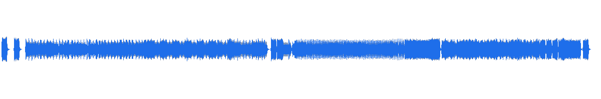
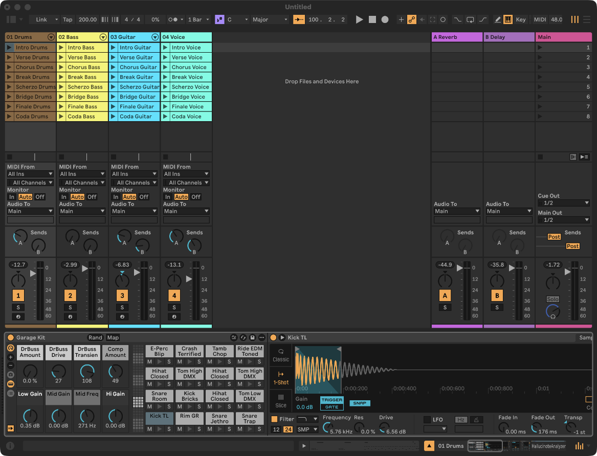
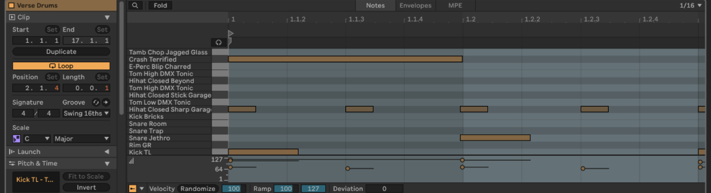
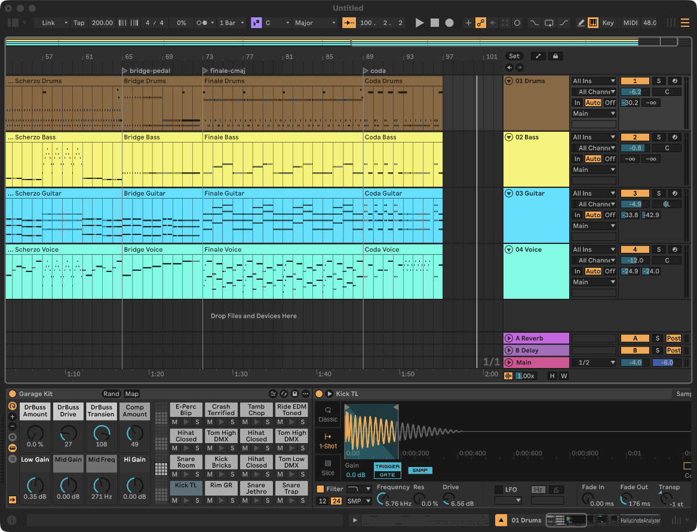
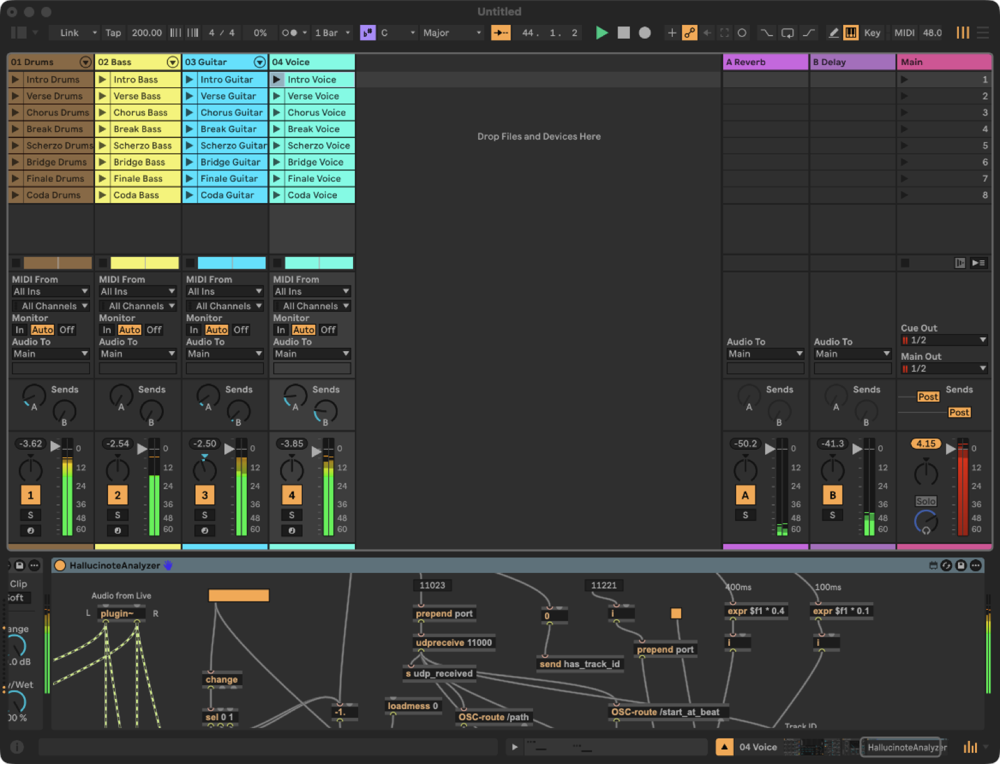
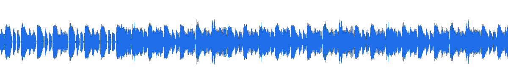
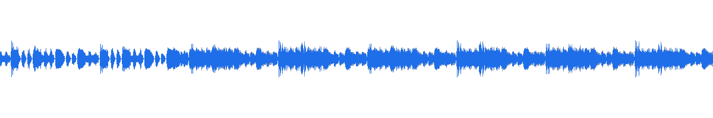
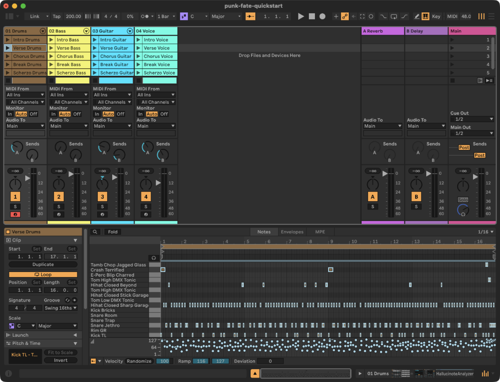
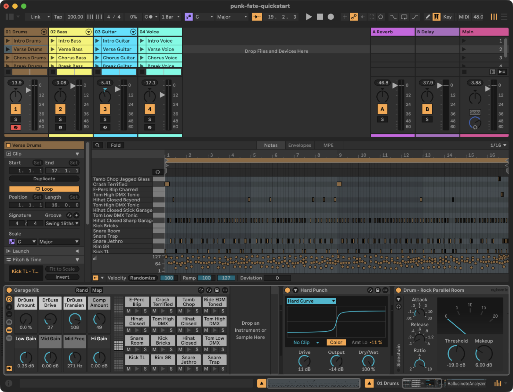
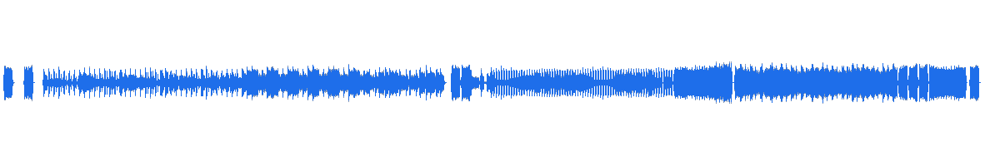

# Making a song, start to finish

Real sessions, documented as they happened.
On 2026-08-11 a Claude Code session was handed the one-sentence prompt below and left to drive.
Forty minutes later a finished, mixed, four-track song was playing in Ableton Live — that's **chapter 1**.
Later the same day the song went back into the studio, because a finished song and a *good* one are different things: **chapter 2** is the listening session that made it actually sound punk.
Every artifact on this page was captured live from those sessions: the transcript excerpts are rendered from the session log, the screenshots were shot by [`tools/capture_live_shot.py`](../tools/capture_live_shot.py) while they ran, and the audio is the renders the sessions themselves measured.

The song ships in this repo.
[`examples/punk-fate/`](../examples/punk-fate/) is the finished source, and `python examples/punk-fate/build.py` rebuilds its database from a clean checkout with no Live installed — that exact replay is what this repo's CI runs.
The *prompt* works differently: hand the same sentence to another agent and it will make different choices, and that's the point — this page walks through how a song gets made, and the audio above is what one run of it produced.

*A fifteen-minute read. One artifact per beat.*

---

## 0 · The result, first

[](assets/tour-chapter2.mp3)

**[▶ punk-fate — 1:58, four tracks](assets/tour-chapter2.mp3)** — Beethoven's
Fifth crammed into basement punk: C minor fate riff → E♭ chorus → A♭ half-time break → hardcore scherzo → dominant-pedal transition → C MAJOR finale.
This is the render as of chapter 2 — the song as it sounds now.
Everything below is how it got made.

---

## Chapter 1 — the composing session

*One prompt to a mixed four-track song, in ten beats.*

### 1 · Ideation → intent

The whole spec the session started from:

> Make a 2-minute punk song that crams the chord progression of Beethoven's
> 5th into those two minutes. Drums, bass, lead guitar, and vocals on a
> staccato synth. Call it punk-fate.

Claude's first move (`/hallucinote:song-brief`) reads what the prompt actually pins down, fills what it can own, and comes back **once**, with proposals:

> **Settled from your prompt:** slug `punk-fate`, ~2:00, 4/4 punk, four parts
> — drums, bass, lead guitar, and a staccato mono-synth playing the "vocal"
> line (so: no lyrics, the synth *sings* the melody; say if you actually want
> words somewhere).
>
> **The one real fork.** "The chord progression of Beethoven's 5th" can mean
> two quite different songs, and it's the creative lock-in I don't want to
> make for you — so it's the question below. The rest I'm telling you, not
> asking.

One question — the famous first-movement material, or the whole four-movement C-minor-to-C-major arc?
The user picked the arc, agreed to 200 BPM, and that was the last decision they were asked to make.
The full brief, with every dimension marked *user / inferred / agreed-after-confirm*, was filed as [`annotations/01-the-brief.md`](../examples/punk-fate/annotations/01-the-brief.md); the fork's reasoning became the first of seven
[decision records](../examples/punk-fate/decisions/).

### 2 · Scaffold + chains

A song is a directory, and the sound ships with it — device chains are authorship:

```
examples/punk-fate/
├── build.py                  # every note, as code
├── captured_session.json     # instruments, device chains, the dialed mix
├── REQUIREMENTS.md           # third-party plugins needed (here: none)
├── annotations/              # scoped intent (the brief, melody intent)
├── decisions/                # why, dated — ADR-shaped records
├── attempts/                 # what was tried, including what was reverted
├── analysis/                 # the measured mix reports (beats 8-9's numbers)
├── measurements/             # evidence a decision cites, kept next to it
└── tests/                    # shape tests; run in this repo's CI
```

Each track got a stock-Live chain picked for the brief's production stance ("raw and blown-out — Beethoven played by a band in a basement"): a Garage Kit drum rack driven into a saturator and glue compressor, palm-muted bass with grit, a deliberately mid-forward crunch guitar, and a square-wave Operator as the shouted "vocal."
The full table — and why the guitar *doesn't* get a third gain stage — is
[`decisions/05-signal-chains.md`](../examples/punk-fate/decisions/05-signal-chains.md).



### 3 · Harmony & form

Harmony is a modeled substrate the parts compose *against*.
The verse churns in C minor; the chorus is the relative-major lift:

```python
# examples/punk-fate/build.py
PROG_VERSE = Progression.of(
    "C", "Minor", ["Cm", "Ab", "Eb", "G"], beats_per_chord=4.0, functional=True)
PROG_CHORUS = Progression.of(
    "Eb", "Major", ["Eb", "Bb", "Cm", "Ab"], beats_per_chord=4.0, functional=True)
```

Beethoven's great third-to-fourth-movement transition — the bass pedals low C for eight bars while the harmony above it tightens — compresses into a progression whose *rhythm* accelerates into the cadence:

```python
# examples/punk-fate/build.py
# Accelerating harmonic rhythm into the cadence — the transition's whole point.
PROG_BRIDGE = Progression.of(
    "C", "Minor", [("Ab", 8.0), ("G", 8.0), ("Ab", 4.0), ("G", 4.0), ("G7", 8.0)],
    functional=True)
```

These progressions are rulers: the melody lens in beat 5 reads every vocal note against them for harmony-fit.
How `build.py` is organized —
[`song-authoring-conventions.md`](song-authoring-conventions.md).

### 4 · Rhythm & feel

Microtiming is written into the parts at generation time.
Each part is a *player* who both carries an authored feel and declares how they breathe:

```python
# examples/punk-fate/build.py
# Guitarist: furthest ahead, loosest, and rushes hardest — the downstroke arm
# is the thing dragging this band forward.
GUITARIST = Player(
    "gtr", drag=-0.010, rush=0.014,
    profile=PerformanceProfile(name="punk-downstroke", timing_sigma=0.030,
                               velocity_sigma=12.0))
```

`drag` is the constant push or pull: the guitar drags the band forward, the bass refuses to be pulled, and the groove lives in the ~16-tick gap *between* them ([`decisions/04-per-part-feel.md`](../examples/punk-fate/decisions/04-per-part-feel.md)).
`rush` creeps a player forward across a bar and resets at the downbeat, because an excited drummer *gets* early as the bar goes on.
(The `PerformanceProfile` — how a player *breathes* on top of what's authored — is chapter 2's story: this session shipped the constant feel, and finding out why that wasn't enough took a listener.)

Every deviation is seeded from the part's identity, so a rebuild reproduces the same performance — which is what lets `build.py` stay a state-converger whose re-run is a no-op.

In the clip editor you can see it — the snare sits just left of the gridline while the kick sits on it:



### 5 · Melody

`hallucinote melody` reads every line against its *declared* profile — every figure it reports is a measurement against stated intent.
Real output from this song:

```
[break-ab]
  Voice — active (confidence 100%, 39 notes) · profile 'shouted-hook' · shaped
    contour: level · apex 79@95% · 16 direction-changes · gradient-stdev 3.41 · repetition-coverage 68%
    phrases (LBDM): 7 · arch → arch → ascending → arch → ascending → ascending → insufficient-data
    intervals: step 62% / leap 38% · post-skip-reversal 67% · alphabet 9 · ambitus 16 semitones
    harmony: 69% chord-tone · 31% non-chord-tone · NCT-resolves-by-step 82% · chord-tone-on-strong-beat 100%
    ? Voice: you declared a low step appetite, but 62% of moving intervals are steps (moderate) — intended proximity/leap balance, or has the line's motion drifted?
```

(Recomputable: the figures above are committed at
[`measurements/2026-08-11-melody-lens.json`](../examples/punk-fate/measurements/2026-08-11-melody-lens.json),
so this block can be checked against the build.)

Those `?` lines are coaching questions — and this one's answer is *intended*: the A♭ break is the one section where the synth genuinely *sings*, so its step-heavy motion is the point.
That answer lives in
[`annotations/02-the-vocal-line-leaps-on-purpose.md`](../examples/punk-fate/annotations/02-the-vocal-line-leaps-on-purpose.md),
which also records the first lens run *correcting the profile itself* — the declared contour was wrong for a line built on Beethoven's leaping cell, and fixing the declaration — the notes stood — took the lens from twelve questions to six.

### 6 · Arrangement

The whole form at a glance — eight sections in 96 bars, every one in a different harmonic place, because at 1.2 seconds a bar there is room for exactly one of the two — a narrative *or* a repeat:



The section budget — and why the finale had to be at least as long as the verse — is
[`decisions/02-tempo-and-the-section-budget.md`](../examples/punk-fate/decisions/02-tempo-and-the-section-budget.md).

### 7 · Materialize

The push is fourteen ordered phases driven against a running Live set.
From the session, verbatim:

> `Bash` — Probe and link a new Ableton session
>
> `Bash` — Execute the fourteen-phase push
>
> All 14 phases OK — the song is in Live. [...] The song is in Live and the
> timeline verifies faithful.

And Live, mid-pipeline — all 32 clips landed, meters live as the set plays:



Re-pushes are idempotent: change one part and re-push, and the phases that have nothing to do report `ok` with zero calls dispatched.
The phase list and what each one owns — [`skills.md`](skills.md).

### 8 · Production & mix

The agent rendered its own work and measured it.
First render:

- master at **+5.51 dBTP** with **257 true-peak overshoots** — clipping, hard
- the bass flagged as the masked instrument in **all eight sections** (0.56–0.70 against the summed bed), sitting **9.7 LU** below the loudest stem

The measured numbers ship with the song — [`analysis/`](../examples/punk-fate/analysis/) holds the before and after reports.
What makes this a *mix review* is what the agent did with the numbers, in its own words:

> The report is unanimous: **the bass is the maskee in every one of the eight
> sections** [...] That directly contradicts the arrangement decision I filed
> an hour ago — the verse holds the guitar back specifically so the *bass*
> carries the engine, and right now the bass is inaudible.

The mix contradicted the song's own composition decision — so the fix was a rebalance *around the bass*.

### 9 · Iterate

One change, its diff, and the before/after.
The rebalance ([`decisions/07-the-bass-carries-the-engine.md`](../examples/punk-fate/decisions/07-the-bass-carries-the-engine.md)):

| fader | before | after |
|---|---|---|
| 01 Drums | +1.2 dB | **−6.2 dB** |
| 02 Bass | 0.0 dB | **−0.8 dB** — the least-trimmed track; the whole fix |
| 03 Guitar | −0.4 dB | **−4.9 dB** |
| 04 Voice | −2.0 dB | **−12.0 dB** — it was out-shouting the band |
| Master | 0.0 dB | **−4.0 dB** — headroom |

…plus sends raised 2–3× and the reverb cut from a 2.5 s hall to the 1.1 s room the brief actually asked for.
Hear it — the same verse-into-chorus passage, first render against the fix:

[](assets/tour-chorus-before.mp3)
**[▶ before](assets/tour-chorus-before.mp3)**

[](assets/tour-chorus-after.mp3)
**[▶ after](assets/tour-chorus-after.mp3)**

Measured on the render: the A/B went **+5.51 → +1.29 dBTP** on the bus and **257 → 1** overshoots.
And one thing stayed honestly *unverified* — the analyzer reads stems pre-fader, so the masking improvement couldn't be confirmed by measurement in the same pass.
That limit is written into the decision record and the
[attempt ledger](../examples/punk-fate/attempts/2026-08-10-master-clipping-and-buried-bass.md).

### 10 · Bake, commit, fork

The dialed mix was captured back into `captured_session.json`, the song rebuilt from scratch, and re-pushed — proving the whole thing survives `build.py --reset`.
From the session's close:

> Everything is baked into `captured_session.json`, so the mix survives a
> `build.py --reset` — rebuilt and re-pushed to prove it. Brief, 7 decisions,
> 2 annotations, and 2 attempt entries are on disk; arrangement verifies
> faithful; tests pass.

A song is a directory in a git repo: diff it, fork it, hand it to a collaborator ([`collaboration.md`](collaboration.md)) — their machine gets its plugin requirements checked before anything pushes.
The last gesture in the source is the song's whole argument, one semitone wide:

```python
# examples/punk-fate/build.py
    _motif(gtr, 7, G_G_HI, G_C, vel=127, player=GUITARIST, power=True, long_dur=2.0)
    _motif(bas, 7, G_G_HI - 12, G_C - 12, vel=125, player=BASSIST, long_dur=2.0)
    _motif(syn, 7, S_G4, S_E5, vel=127, player=SINGER, long_dur=2.0)
```

The song opened on G-G-G-E♭.
It ends on the identical rhythm, E natural — darkness to triumph, exactly as advertised.
It is also the one bar in the coda left at `heat=1.0` while everything around it runs at 1.5: the band comes apart for seven bars and locks together for the last gesture, because a band aiming at a final stab hits it together.
The tightening *is* the ending.

---

## Chapter 2 — back into the studio

*The composing session ended with every meter green.
Then somebody listened to it.* Later the same day the song came back with the one review no analyzer produces — a human ear saying it wasn't done — and went through two studio sessions: a **performance pass** (the timing, the drums, the dirt) and a **sound pass** (the gain staging, the master bus, and finally the lead instrument itself).
The whole chapter is that ear-verdict being turned into measurements, and the measurements into fixes.
It is also why the song's [decision records](../examples/punk-fate/decisions/) outgrew the seven chapter 1 filed — each pass could read what the previous one had decided and extend it.

### 11 · "Definitely Beethoven, but not especially punk"

That was the brief for the whole chapter, in the user's words — *"Where are the garage drums?
Where's the sloppy but enthusiastic timing?"* The first thing the session did was measure the complaint.
From the session, verbatim:

> There's the smoking gun: **the bass had 0.00 ms of grid deviation** — every
> note the exact same distance from the grid.

All 623 bass notes the identical distance off the grid: chapter 1's per-part feel was a *perfectly quantized band slid a few ticks*, and the performance lens grades exactly that shape **mechanical**.

Getting from there to human took three moves, and the first two were dead ends worth recording.
A per-note random nudge fixed the tightness and landed on the opposite failure — **`sloppy`, lag-1 autocorrelation 0.135** — because what reads as human is the *correlation* of a deviation: real players drift in 1/f.
That one surfaced in the independent Critic review, against the project's own performance model, after the ear had passed it.
Then splitting the kit into two breathing streams (a hand wobbles more than a foot) measured *worse* than one — the agent reading its own result:

> Decisive result — and it caught a flaw in my own limb-split. Bass/guitar/voice
> read **human**, but the drums read **sloppy** (acf 0.135): interleaving two
> independent 1/f streams decorrelates the combined series. A drummer is one
> performer, not two:

What shipped is the third move, the one beat 4 now shows: a declared `PerformanceProfile` per player, realized over the finished part.
The same lens that started this beat closes it:

```
part        classification   stdev  lag1-acf    dfa  onsets
01 Drums    human           0.0185     0.623   0.99     183
02 Bass     human           0.0162     0.543   1.02     128
03 Guitar   human           0.0309     0.385   0.89     287
04 Voice    human           0.0324     0.716   1.38      67
```

All four parts **human**, with DFA α near 1.0 — the signature of genuine 1/f.
Punk gets to keep its big deviation, because magnitude is the one axis that doesn't change the verdict.
The measurement ships at [`measurements/2026-08-11-performance-lens.txt`](../examples/punk-fate/measurements/2026-08-11-performance-lens.txt); the dead ends ship too, in the
[attempt ledger](../examples/punk-fate/attempts/2026-08-11-making-the-band-sound-human.md),
so no later session re-walks them ([`decisions/08-sloppy-but-enthusiastic.md`](../examples/punk-fate/decisions/08-sloppy-but-enthusiastic.md)).

### 12 · Garage drums are vocabulary

Breathing alone doesn't make a kit sound like a room.
The other half of the fix is *what the drummer plays*: ghost snares between the backbeats, hats that open where a hand would lean on them, an extra kick where the foot gets ahead of itself — and, doing more work than any of those, the hat that simply isn't there:

```python
# examples/punk-fate/build.py
    for i in range(8):
        pos = i * 0.5
        if _rand("hatdrop", bar, pos) > 0.88:
            continue                                  # the hat that isn't there
```

Programmed drums are recognisable precisely because every hat is present and identical, so the hole is the one thing no drum machine produces.
Measured over the 16-bar verse: **53 ghost snares** at velocity 26–53, **8 of 128 hats dropped**, 13 extra kicks — all deterministic, seeded from each note's identity, so every rebuild misses the same hats.
In the clip editor the vocabulary is visible as texture — the ghost-note scatter along the bottom of the velocity lane:



The scatter also surfaced a real bug: two generators wrote the same snare on the same tick, which the database silently deduplicated *until* per-note deviation made them a genuine 5 ms overlap — which a Live clip cannot hold, so Live merged them and the push's integrity check failed.
The guards that fix it (`_one_hit_at_a_time`, `_no_same_pitch_overlap`) removed 8 double-triggers that had been in the song, inaudible, since it was written, and trim 63 note durations Live would otherwise silently truncate — and both now have tests ([`tests/test_punk_fate_build.py`](../examples/punk-fate/tests/test_punk_fate_build.py)).

### 13 · The dirt

*"Where's the distortion?"* Two of the four tracks carried none — and chapter 1's own
[`05-signal-chains.md`](../examples/punk-fate/decisions/05-signal-chains.md)
had already named the exact knob to reach for when this moment came: Pedal *Guitar Dirt* on the guitar.
It got that.
The voice got a Saturator *Rough Tone* — a shouted voice through a cheap PA clips, and fuzz on a square wave is mush — and the drum saturator's drive went from 6.9 to **11 dB**, output trimmed down to match.
Grit as timbre:



Two constraints Live imposed are recorded ([`decisions/09-the-dirt.md`](../examples/punk-fate/decisions/09-the-dirt.md)): device loads tail-append and Live 12.4 has no reorder API, so the new stages sit *after* the compressor, departing from the authored order — defensible for a wall-of-sound genre, and written down as a deliberate departure.
And appending devices had pushed them *past the analyzer*, which would have captured every stem pre-distortion while reporting `ok` — caught because the manifest's `terminal` flag was re-checked.
Headroom held at the output, measured across all eight sections: delivered ≈ **−2.1 to −2.6 dBTP** across three renders (a realtime capture has run-to-run spread, and the decision records the range).
The *bus* did not: it sat at **+1.93 dBTP with 2–4 overshoots** depending on the capture, which is the number beat 14 fixes by putting a limiter where the fader had been standing in for one.

### 14 · It has to *sound* punk — the preset names were lying

The next listen came back harsher: *"The lead instrument sounds like an electronic trumpet, not a guitar.
The drums are small.
The whole thing is kind of cute, and not at all noisy."* And nothing was broken — every device loaded, every check green.
The finding ([`decisions/10-it-has-to-sound-punk.md`](../examples/punk-fate/decisions/10-it-has-to-sound-punk.md)) is the chapter's best lesson: **every chain had been chosen by preset name and never verified by parameter.**

| what the name promised | what the parameters said |
|---|---|
| *Dual Amped **Crunch*** | both amps on `Amp Type: Blues`, low gain |
| Pedal *Guitar **Dirt*** | **1.6 % drive**, mids scooped |
| — (declared nowhere) | a 24 %-wet Reverb hiding *inside* the guitar rack |
| Saturator *Hard Punch* | fine — but the drum fader sat at **−13.9 dB** |
| — | no compressor or limiter on the master at all |

A clean sampled guitar through a blues amp in a big room, drums 11 dB under the bass: "electronic trumpet" and "cute" are fair.
The tell is physical.
From the session, verbatim:

> Right — and that's the mechanism: with almost no distortion, the three
> power-chord notes never intermodulate, so they read as separate oscillators
> instead of one guitar. Let me put real gain in.

Distortion's intermodulation is what fuses a power chord's three strings into *a guitar* — which is why two passes of humanizing the *performance* never touched the complaint.
The fix: `Rock` amps mid-forward, pedal drive to **42 %**, the hidden room dialed nearly dry, drums up **11 dB** — affordable because the master finally got what three passes of pulling faders down had been substituting for: a **Glue Compressor into a Limiter**.
Punk loudness comes from glue and clipping.
Measured, full song: the master bus landed at **−0.34 dBTP** with **0 overshoots**, and the guitar stem's spectral flatness nearly doubled, **0.083 → 0.156** — noisier *and* louder, the trade every earlier pass had gotten backwards.
The rule it earns: **a preset name is a claim; the parameters are the measurement** — after loading a chain, read back the ones that carry the intent.

And the rule bites the measurement too.
The committed report for this render disagrees with that −0.34: its `delivered_true_peak_dbtp` field reads −4.34, because it *derives* delivered from a `master_fader_db` the analyzer reported as −4.0 when the fader was already at unity.
The tell is a coincidence that can't be one: this report and the previous pass's carry byte-identical fader readings, across two renders with a fader move between them.
The next render reports the field as unity — so the bus figure is the honest one here, and the derived one is the artifact ([`decisions/10`](../examples/punk-fate/decisions/10-it-has-to-sound-punk.md) records both readings).
A number that ships next to its evidence is checkable; this is what checking it looks like.

### 15 · The vocal line is a lead guitar now

One synthetic thing remained.
*"The voice patch is still very main street electrical parade … it's the timbre that's very beep beep beep bloop."* The measured tell had been there the whole time: the Voice stem's spectral centroid sat at **2125 Hz** while every other part in the band sat at 77–604 Hz — a separate, obviously-electronic object floating on top.

Chapter 1's formant argument for a square wave (it sits where a shouted vocal sits) was *correct about frequency range and still wrong about genre* — it made the line legible as a vocal, and the genre needed more.
The user retired it — *"yeah punk was mostly just bass and one guitar, but here we are"* — and track 4 became a second guitarist: `Dual Amped Heavy` on `Lead` amps, dry, close-mic'd, the vocal-style slapback sends cut back hard ([`decisions/11-the-vocal-line-is-a-lead-guitar.md`](../examples/punk-fate/decisions/11-the-vocal-line-is-a-lead-guitar.md)).
The preset lied *again* — "Heavy" loaded as mid-gain `Rock` — and was caught in one `get_parameters` call this time, because beat 14's rule was already filed.
The swap moved master spectral flatness **0.192 → 0.247**, the single biggest jump in noisiness of any pass on this song, while the other three stems' flatness moved by at most 0.0013 — confirming the teardown disturbed nothing else.
The track is still named `04 Voice`: the *role* is unchanged, and the name records the part's function while the decision records its instrument.

### 16 · Hear the difference

The whole chapter, A/B.
Where chapter 1's render ended — mixed, measured, and polite:

[](assets/tour-chapter1.mp3)
**[▶ before — chapter 1's render](assets/tour-chapter1.mp3)**

And after the listening session — the same song, played by a band:

[](assets/tour-chapter2.mp3)
**[▶ after — the chapter 2 render](assets/tour-chapter2.mp3)**

The review that closed the chapter came in while that render was still playing through Live, queued mid-capture, verbatim:

> oh that's great. chef's kiss, thumbs up.

The tone passes moved master spectral flatness **0.191 → 0.247** (the measured shape of "noisier" — and almost all of it came from retiring the square wave), delivered true peak landed at **−0.40 dBTP with zero overshoots**, and all four parts read **human** on the performance lens.
Every number ships next to the song in [`measurements/`](../examples/punk-fate/measurements/), each cited by the decision that acted on it.

And the chapter ends the honest way: with something *not* done.
Both guitar racks' `Articulate` macro is parked at 0 — the rhythm guitar never switches between palm-mute and ring, the lead never engages its glide — and
[`decisions/10-it-has-to-sound-punk.md`](../examples/punk-fate/decisions/10-it-has-to-sound-punk.md)
names that **UNDECIDED, owner: next compose pass**.
That is what makes a song a *live* project: a recorded frontier, waiting for chapter 3.

---

**Do it yourself:** [`quickstart.md`](quickstart.md) is the ten-minute version with your own song.
**The map and the why:**
[`song-workflow.md`](song-workflow.md).
